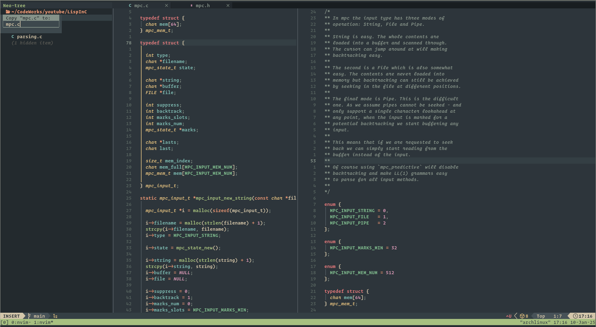

# 🧙 MONK's Neovim Configurations

Welcome to my **Neovim configuration** repository! 🎉  
This repo features two branches:  
- **`main`**: My new configuration based on **LazyVim** with custom tweaks.  
- **`scratch`**: My old Neovim setup for reference.

---

## 🔧 Installation

Follow the steps below to try out my **LazyVim**-based Neovim setup from the `main` branch.

### 📜 Prerequisites  
Ensure you have:  
- **Neovim 0.9+** installed.  
- A backup of your current Neovim configuration (just in case).

### 🚀 Steps to Install  
1. **Clone the repository**:  
```bash  
git clone -b main git@github.com:devnchill/Neovim ~/.config/nvim  
```

2. **Launch Neovim**:  
```bash  
nvim  
```

3. **LazyVim will handle the rest** by automatically installing plugins on the first run.

---

## 🗑️ Removing the Configuration  
To completely remove my configuration, run the following commands:

1. **Delete the Neovim config folder**:  
```bash  
rm -rf ~/.config/nvim  
```

2. **Delete the Neovim data folder**:  
```bash  
rm -rf ~/.local/share/nvim  
```

3. **Delete the Neovim cache folder**:  
```bash  
rm -rf ~/.cache/nvim  
```

4. **Remove the Neovim state folder**:  
```bash  
rm -rf ~/.local/state/nvim  
```

---

## 🧩 Switching Branches  
If you want to try out my old config from the `scratch` branch, follow these steps:

1. **Navigate to your Neovim config folder**:  
```bash  
cd ~/.config/nvim  
```

2. **Switch to the `scratch` branch**:  
```bash  
git checkout scratch  
```

3. **Launch Neovim**:  
```bash  
nvim  
```

---

## 📸 Preview  
Here’s a sneak peek of my **Neovim** setup:


---

## 📦 Folder Structure  
```plaintext  
# Neovim Configuration Structure
~/.config/nvim  
├── init.lua  
├── lazy-lock.json  
├── lazyvim.json  
├── LICENSE  
├── lua  
│   └── config  
│       ├── autocmds.lua  
│       ├── keymaps.lua  
│       ├── lazy.lua  
│       ├── options.lua  
│       └── terminal.lua  
├── lua  
│   └── plugins  
│       ├── colorscheme.lua  
│       ├── example.lua  
│       ├── jaq.lua  
│       └── tmux-navigator.lua  
└── stylua.toml  
```

---

## ⚡ Plugins  
The `main` branch is built using **LazyVim**, which includes the following custom files under `lua/config`:  
- **`autocmds.lua`**  
- **`keymaps.lua`**  
- **`lazy.lua`**  
- **`options.lua`**  
- **`terminal.lua`**  

Feel free to explore and modify them!

---

## 🧑‍💻 Author  
**MONK** ([@DevNChill](https://github.com/devnchill))  
Happy coding! 🚀  
