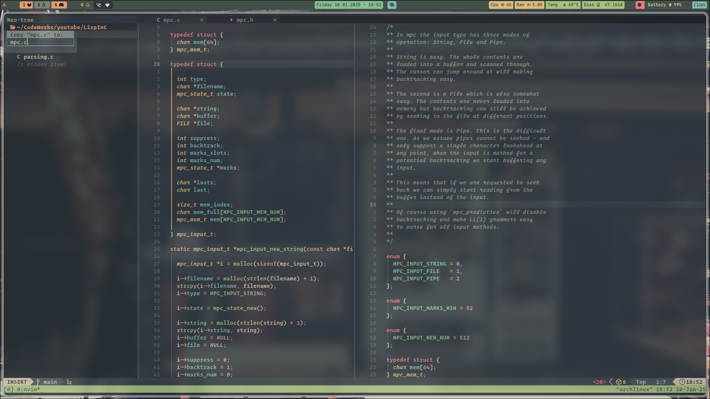
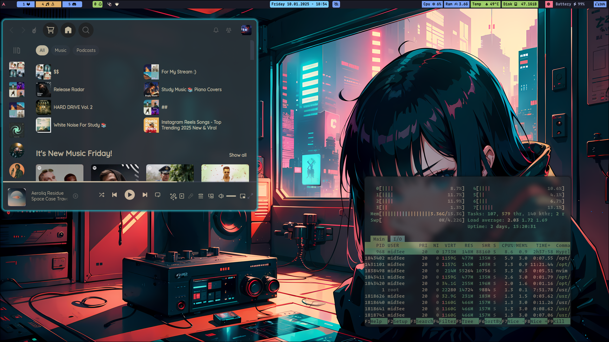

# dotArch
# MONK DOTFILES  

  
  
  
  

---  

## ✨ Inspiration  
I like to personalize my environment to make my workflow easier at every step. My dotfiles are designed to maximize keyboard usage and minimize mouse usage as much as possible.  

Although these dotfiles were inspired by various sources, I've tweaked them to the point that I can confidently call them my own.  

---  

## 🛠 My Tools  
I use **Hyprland** as my window compositor on Arch Linux. Yes, I use *Arch, btw*.  

### Here's a quick overview of my tools:  
- **Neovim (Nvim)** running in **Kitty** terminal (I avoid GUI versions like Neovide, as they feel unnecessary).  
- **[LazyGit](https://github.com/jesseduffield/lazygit)** for Git management, both from the terminal and via a custom Lua function that opens it in a floating terminal inside Neovim.  
- **[Tmux](https://github.com/tmux/tmux)** for managing multiple projects and processes, which I believe drastically improves my productivity. I've remapped several default keybindings to better fit my workflow.  
- **[Ranger](https://github.com/ranger/ranger)** as my terminal file manager — simple and sufficient for daily usage.  

---  

## 📦 Neovim Setup  
Here's an overview of the plugins I use to enhance my Neovim experience:  

| Plugin               | Description                                  | Link |
|----------------------|----------------------------------------------|------|
| [`jaq-nvim`](https://github.com/axkirillov/jaq-nvim) | Run programs inside a floating buffer        | [GitHub](https://github.com/axkirillov/jaq-nvim) |
| [`mason`](https://github.com/williamboman/mason.nvim) | Manage LSP servers, DAPs, linters, and formatters | [GitHub](https://github.com/williamboman/mason.nvim) |
| [`nvim-dap`](https://github.com/mfussenegger/nvim-dap) | Debugging for C/C++ and JavaScript programs  | [GitHub](https://github.com/mfussenegger/nvim-dap) |
| [`nvim-lspconfig`](https://github.com/neovim/nvim-lspconfig) | Easy setup for various LSP servers           | [GitHub](https://github.com/neovim/nvim-lspconfig) |
| [`efm-langserver`](https://github.com/mattn/efm-langserver) | Formatter and linter that attaches to files  | [GitHub](https://github.com/mattn/efm-langserver) |
| [`which-key`](https://github.com/folke/which-key.nvim) | Displays available keybindings               | [GitHub](https://github.com/folke/which-key.nvim) |
| [`tokyonight`](https://github.com/folke/tokyonight.nvim) | Customized dark bluish colorscheme           | [GitHub](https://github.com/folke/tokyonight.nvim) |
| [`cord.nvim`](https://github.com/ayamir/cord.nvim) | Discord presence integration                | [GitHub](https://github.com/ayamir/cord.nvim) |
| [`friendly-snippets`](https://github.com/rafamadriz/friendly-snippets), [`emmet-vim`](https://github.com/mattn/emmet-vim), [`cmp-*`](https://github.com/hrsh7th/nvim-cmp), [`codeium`](https://github.com/Exafunction/codeium.nvim), [`ts-autotag`](https://github.com/windwp/nvim-ts-autotag) | Tools for snippets and autocompletions (Note: Codeium is not enabled by default as I'm still learning it) | |
| [`nvim-tree`](https://github.com/nvim-tree/nvim-tree.lua), [`nvim-treesitter`](https://github.com/nvim-treesitter/nvim-treesitter) | File tree and syntax highlighting | |
| [`telescope`](https://github.com/nvim-telescope/telescope.nvim) | Fuzzy finding files and grepping words       | [GitHub](https://github.com/nvim-telescope/telescope.nvim) |
| [`harpoon`](https://github.com/ThePrimeagen/harpoon) | Quick navigation across files                | [GitHub](https://github.com/ThePrimeagen/harpoon) |
| [`lualine`](https://github.com/nvim-lualine/lualine.nvim) | Status line that displays mode, buffers, git branch, macros, etc. | [GitHub](https://github.com/nvim-lualine/lualine.nvim) |
| [`tmux-navigator`](https://github.com/christoomey/vim-tmux-navigator) | Consistent navigation between Tmux and Neovim | [GitHub](https://github.com/christoomey/vim-tmux-navigator) |

---  

## 💻 Hyprland Tools  
| Tool                 | Description               | Link |
|----------------------|---------------------------|------|
| Waybar               | Status bar for Wayland     | [Waybar](https://github.com/Alexays/Waybar) |
| Sway Notification Center | Notification system     | [SwayNC](https://github.com/jJPoohs/swaync) |
| HyprSwitch           | Application switcher       | [HyprSwitch](https://github.com/hyprwm/Hyprland) |
| Rofi                 | Application launcher       | [Rofi](https://github.com/davatorium/rofi) |
| Swww                 | Wallpaper manager          | [Swww](https://github.com/Horus645/swww) |

---

## 🖼️ Preview  
Here’s a quick preview of my setup:  

Feel free to customize this further to match your preferences!
